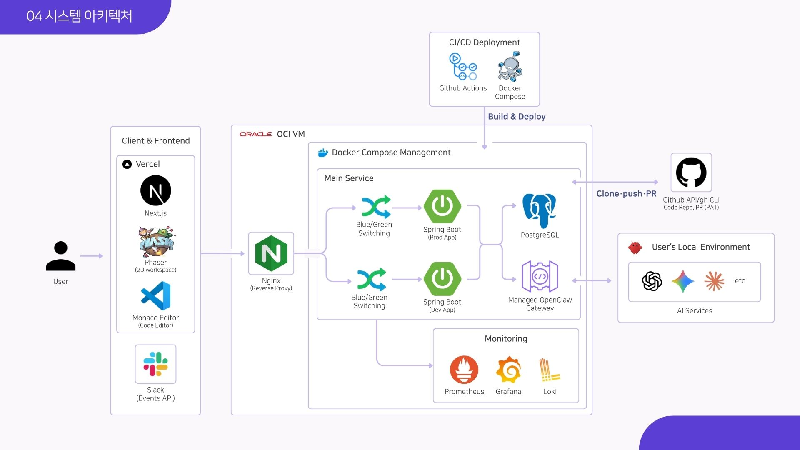

# 🤖 AI-Office

> **협업형 AI 에이전트 운영 플랫폼**  
> Task 배정부터 결과 공유까지 — AI Agent를 팀 업무 흐름 안에서 운영하고 추적합니다.

<p align="center">
  <a href="https://int-1-project-team01-fe.vercel.app/">
    
  </a>
  &nbsp;
  <a href="https://github.com/Programmers-Intern-Program/INT1-Project-Team01">
    
  </a>
</p>

<p align="center">
  
  
  
  
  
</p>

---

## 목차

- [프로젝트 개요](#프로젝트-개요)
- [주요 기능](#주요-기능)
- [시스템 아키텍처](#시스템-아키텍처)
- [주요 프로세스 / AI 설계](#주요-프로세스--ai-설계)
- [기술 스택](#기술-스택)
- [시작하기](#시작하기)
- [환경 변수](#환경-변수)
- [ERD](#erd)
- [API 명세](#api-명세)
- [테스트 커버리지](#테스트-커버리지)
- [모니터링](#모니터링)
- [CI/CD](#cicd)
- [트러블 슈팅](#트러블-슈팅)
- [성과 및 회고](#성과-및-회고)
- [팀 소개](#팀-소개)
- [관련 링크](#관련-링크)

---

## 프로젝트 개요

### 배경

AI Agent는 강력하지만, **팀 업무 흐름 안에서 운영·추적하기 어렵습니다.**

| 문제 | 설명 |
|------|------|
| 작업 흐름 분산 | 요청, 실행, 결과가 서로 다른 도구에 흩어짐 |
| 상태 추적 어려움 | 진행 중·완료·실패 여부를 팀원이 함께 보기 어려움 |
| 협업 기록 부족 | Agent 결과가 Task, Report, Artifact로 남지 않음 |

### 목표

단순 에이전트 실행이 아니라, **업무 요청부터 실행·기록·공유까지 하나의 협업 흐름**으로 연결하는 플랫폼을 만들었습니다.

| 구분 | AS-IS (현재) | TO-BE (개선 후) |
| :--- | :--- | :--- |
| **인터페이스** | CLI 명령어와 설정 파일 중심 | 웹 GUI와 Slack 기반 자연어 요청 |
| **관리 체계** | 개별 대화와 로그에 흩어짐 | Task 상태로 통합 관리 |
| **모니터링** | 터미널 로그를 직접 확인 | Dashboard에서 진행/완료/실패 확인 |
| **데이터 구조** | 파일과 응답이 분산 | Artifact, Log, Report로 구조화 |

### 핵심 가치

- **Workspace 기반**: 팀 단위로 Agent를 생성·관리하고 권한을 분리
- **자연어 요청**: Slack 멘션 한 줄로 AI 에이전트가 작업을 수행
- **실행 추적**: created → assigned → running → saved 전 과정을 Dashboard에서 확인

---

## 주요 기능

| 기능 | 설명 |
|------|------|
| **자연어 → Task 변환** | 사용자 업무 요청을 Agent가 수행 가능한 Task로 생성, 담당 Agent에 자동 배정 |
| **역할별 Agent 생성** | Backend, Frontend, QA 등 역할에 맞는 Agent를 Workspace 내에서 관리 |
| **작업 상태 추적** | 진행 중·완료·실패 상태와 실행 로그를 Dashboard에서 실시간 확인 |
| **결과 공유 자동화** | Agent 결과를 Report와 Artifact로 저장, Slack/GitHub 흐름에 자동 연결 |
| **Multi-Agent 조율** | Orchestrator가 READY Agent 목록 기반으로 작업을 자동 분배 |
| **Slack 연동** | 멘션 기반 요청 파싱, 작업 결과 포맷팅 메시지 자동 보고 |
| **GitHub 연동** | PAT AES-256-GCM 암호화 저장, 코드 Clone·Push·PR 자동화 |
| **워크스페이스 보안** | 토큰 기반 초대 링크 발급, 멤버십·ADMIN/MEMBER 역할 분리 |

---

## 시스템 아키텍처



```
[Client & Frontend]                [OCI VM - Docker Compose]
  Vercel                           ┌─────────────────────────────────┐
  ├── Next.js                      │  Nginx (Reverse Proxy)          │
  ├── Phaser (2D Workspace)   ───► │  ├── Spring Boot (Blue/Green)   │
  ├── Monaco Editor                │  ├── PostgreSQL                 │
  └── Slack (Events API)           │  └── Managed OpenClaw Gateway   │
                                   │                                 │
                                   │  [Monitoring]                   │
                                   │  Prometheus · Grafana · Loki    │
                                   └─────────────────────────────────┘
                                            │
[CI/CD]                            [External]
  GitHub Actions                   GitHub API / gh CLI
  Docker Compose Build & Deploy    User's Local OpenClaw Gateway
                                   (ngrok으로 클라우드 서버와 연결)
```

---

## 주요 프로세스 / AI 설계

### 1. LLM 연동 전체 설계 방향

Java 서버가 LLM API를 직접 호출하는 방식이 아니라, **OpenClaw Gateway를 LLM 실행 계층**으로 두고 Java 서버가 Gateway RPC를 호출하는 구조로 설계했습니다.

| 설계 원칙 | 내용 |
|-----------|------|
| 서버 책임 분리 | Java 서버는 인증·워크스페이스·Agent·채팅·Task·Slack 연동을 관리 |
| 실행 책임 분리 | OpenClaw는 실제 Agent 실행·LLM 모델 호출·세션 실행 환경을 담당 |
| 변경 영향 최소화 | 모델 제공자·실행 환경이 바뀌어도 서버 도메인 로직 변경을 최소화 |
| 로컬 런타임 활용 | 사용자의 로컬 OpenClaw Gateway도 ngrok을 통해 클라우드 서버와 연결 |
| Agent Runtime 확장 | 단순 API 호출이 아니라 역할 기반 Agent 실행 구조로 확장 가능 |

### 2. Agent 역할 설계 — AGENTS.md 자동 생성 및 Skill 주입

Agent가 단순히 하나의 LLM처럼 동작하면 매번 역할 설명을 길게 넣어야 하고, 답변 품질도 흔들릴 수 있습니다. 그래서 **Agent 생성 시점에 역할별 Skill MD를 AGENTS.md 형태로 주입**하도록 설계했습니다.

```
COMMON.md + Category별 .md → AGENT.md 생성 → agents.files.set RPC → OpenClaw Agent 동기화
```

| Agent 역할 | 특화 판단 기준 |
|------------|----------------|
| ORCHESTRATOR | 사용 가능한 Worker Agent 목록 파악 후 작업 자동 분배 |
| BACKEND | Layered Architecture 준수, API 계약 검증, DB migration 위험 명시 |
| FRONTEND | UI 상태 처리, 컴포넌트 설계 |
| QA | 회귀 검증, 테스트 보강 |
| CUSTOM | 사용자 정의 역할 |

### 3. LLM 응답 JSON Intent 계약

LLM 응답을 자유 텍스트로만 받으면 서버 자동화가 어렵습니다. Agent 응답은 의도에 따라 **JSON 계약**을 따르도록 설계했습니다.

```json
// CHAT — 일반 채팅
{ "intent": "CHAT", "message": "사용자에게 보여줄 응답" }

// TASK — 단일 Task 생성
{
  "intent": "TASK",
  "message": "작업을 시작합니다.",
  "task": { "title": "API 응답 개선", "taskType": "FEATURE_IMPL", "priority": "MEDIUM", "createPr": false }
}

// ORCHESTRATE — Multi-Agent 조율
{
  "intent": "ORCHESTRATE",
  "plan": {
    "steps": [
      { "stepKey": "back-1", "agentId": 1, "category": "BACKEND", "dependsOn": [] },
      { "stepKey": "qa-1",   "agentId": 3, "category": "QA",      "dependsOn": ["back-1"] }
    ]
  }
}
```

### 4. Multi-Agent 조율 흐름

```
User → Orchestrator Agent → Backend / Frontend / QA Agent → 결과 취합 → User
```

- Orchestrator가 현재 READY 상태의 Agent 목록을 확인하고 역할을 판단해 자동 할당
- `dependsOn` 기준으로 순차·병렬 실행 순서를 제어
- 다중 Agent가 동일한 파일을 동시에 수정하는 충돌을 사전 방지 (Lock 추가)

### 5. 로컬 OpenClaw Gateway 클라우드 연결 (ngrok)

MVP에서는 사용자의 로컬 OpenClaw Gateway와 클라우드 Java 서버를 연결해야 했습니다. 클라우드 서버는 `localhost:18789`에 직접 접근 불가하므로 **ngrok으로 WSS 터널링**을 구성했습니다.

```
operator scope 요청 → connect.challenge 수신 → device signature 생성 → connect handshake → 승인
```

---

## 기술 스택

| 영역 | 사용 기술 |
|------|-----------|
| **Frontend** | Next.js 16, React 19, TypeScript, Tailwind CSS 4, Phaser 4 (2D Workspace), Monaco Editor, lucide-react, Vercel |
| **Backend** | Java 21, Spring Boot 4.x, Spring Security, Spring Data JPA, JWT, Google OAuth, Google Tink |
| **Database** | PostgreSQL, H2 (테스트용) |
| **Realtime** | SSE, WebSocket RPC |
| **AI 연동** | OpenClaw Gateway (WebSocket RPC), AGENTS.md Skill 주입, JSON Intent Contract |
| **보안** | AES-256-GCM (외부 연동 토큰 암호화), Google Tink AEAD (Gateway 토큰), HMAC-SHA256 (Slack 서명 검증), JWT state 위변조 방지 |
| **Infra** | OCI VM, Docker Compose, Nginx, Terraform, Cloudflare |
| **CI/CD** | GitHub Actions, Blue/Green 무중단 배포, SpotBugs, JUnit, JaCoCo |
| **모니터링** | Prometheus, Grafana, Grafana Loki, K6 (부하 테스트) |
| **협업** | Jira, GitHub, Slack, Discord, Notion |

---

## 시작하기

### 사전 요구사항

- JDK 21+
- Node.js 20+
- Docker & Docker Compose
- OpenClaw Gateway (로컬 실행)
- ngrok (로컬 Gateway 터널링용)
- Slack App (Events API, OAuth 2.0)

### 1. 저장소 클론

```bash
git clone https://github.com/Programmers-Intern-Program/INT1-Project-Team01.git
cd INT1-Project-Team01
```

### 2. 환경 변수 설정

루트에 `.env` 파일 생성 (아래 [환경 변수](#환경-변수) 참고)

### 3. 인프라 실행

```bash
docker compose up -d
```

### 4. 백엔드 실행

```bash
cd backend
./gradlew bootRun
# http://localhost:8080
# Swagger UI: http://localhost:8080/swagger-ui/index.html
```

### 5. 프론트엔드 실행

```bash
cd frontend
npm install
npm run dev
# http://localhost:3000
```

### 6. OpenClaw Gateway 연결

```bash
# 로컬에서 OpenClaw Gateway 실행 후 ngrok으로 터널링
ngrok http 18789
# 생성된 wss:// 주소를 웹 대시보드 → Gateway 연동 설정에 입력
```

---

## 환경 변수

루트에 `.env` 파일을 생성하고 아래 값을 채워주세요.

### 인증

| 변수 | 설명 |
|------|------|
| `GOOGLE_OAUTH_CLIENT_ID` | Google OAuth App Client ID |
| `GOOGLE_TOKEN_INFO_BASE_URL` | Google 토큰 검증 엔드포인트 (기본값 사용 가능) |
| `ADMIN_ALLOWLIST_EMAILS` | 관리자로 자동 승격할 이메일 목록 (쉼표 구분, 선택) |
| `CUSTOM_JWT_SECRET_KEY` | JWT 서명 키 |
| `SLACK_OAUTH_STATE_SECRET` | Slack OAuth state 위변조 방지 서명 키 |

### 이메일 (초대 링크 발송)

| 변수 | 설명 |
|------|------|
| `YOUR_EMAIL_ADDRESS` | SMTP 발신 이메일 주소 |
| `YOUR_EMAIL_PASSWORD` | SMTP 비밀번호 (앱 비밀번호 권장) |

### 암호화

| 변수 | 설명 |
|------|------|
| `ENCRYPTION_SECRET` | GitHub PAT 등 외부 연동 토큰 암호화용 AES-256 마스터 키 |

### 데이터베이스

| 변수 | 설명 |
|------|------|
| `DEV_POSTGRES_DB` | 개발 DB 이름 |
| `DEV_POSTGRES_USER` | 개발 DB 사용자 |
| `DEV_POSTGRES_PASSWORD` | 개발 DB 비밀번호 |
| `PROD_POSTGRES_DB` | 운영 DB 이름 |
| `PROD_POSTGRES_USER` | 운영 DB 사용자 |
| `PROD_POSTGRES_PASSWORD` | 운영 DB 비밀번호 |

### Slack 연동

| 변수 | 설명 |
|------|------|
| `SLACK_CLIENT_ID` | Slack OAuth App Client ID |
| `SLACK_CLIENT_SECRET` | Slack OAuth App Client Secret |
| `SLACK_SIGNING_SECRET` | Webhook 요청 HMAC-SHA256 서명 검증키 |
| `SLACK_REDIRECT_URI` | OAuth 콜백 URI (예: `https://your-domain.com/api/v1/slack/oauth/callback`) |

### 공통

| 변수 | 설명 |
|------|------|
| `TZ` | 타임존 (기본값: `Asia/Seoul`) |

---

## ERD



주요 테이블 요약:

```
USERS ──< WORKSPACES ──< AGENTS ──< TASKS ──< TASK_EXECUTIONS
                    ──< SLACK_INTEGRATIONS      ──< TASK_ARTIFACTS
                    ──< GITHUB_CREDENTIALS      ──< TASK_EXECUTION_LOGS
                    ──< WORKSPACE_GATEWAY_BINDINGS
                    ──< ORCHESTRATOR_SESSIONS ──< ORCHESTRATION_PLANS
```

---

## API 명세

전체 API 명세는 Swagger UI에서 확인하세요: [api.kimhss.site/swagger-ui/index.html](https://api.kimhss.site/swagger-ui/index.html)

### 핵심 API 요약

| 도메인 | Method | Endpoint | 설명 | 기술 포인트 |
|--------|--------|----------|------|-------------|
| 인증 | POST | `/api/v1/auth/google/login` | Google OAuth 로그인 | JWT, Security |
| 워크스페이스 | POST | `/api/v1/workspaces/{id}/invite` | 초대 링크 발급 | Token, Email-Delivery |
| 에이전트 | POST | `/api/v1/workspaces/{id}/agents` | Agent 생성 및 Skill 주입 | OpenClaw Gateway RPC |
| 작업 | POST | `/api/v1/workspaces/{id}/tasks/run` | Orchestrator/Agent 실행 | Multi-Agent Core |
| 산출물 | GET | `/api/v1/workspaces/{id}/tasks/{taskId}/reports` | Agent 결과 조회 | Artifact |
| GitHub | POST | `/api/v1/workspaces/{id}/github/credentials` | PAT 등록 | AES-256-GCM Encryption |
| Slack | POST | `/api/v1/slack/events` | Webhook 이벤트 수신 | HMAC-SHA256, Event Pub-Sub |

---

## 테스트 커버리지

GitHub Actions CI에서 Checkstyle · SpotBugs · JUnit 5 · JaCoCo를 자동으로 실행합니다.

| 항목 | 결과 |
|------|------|
| 전체 테스트 케이스 | **474개** (전부 통과) |
| Line Coverage | **86%** (목표 80% 초과 달성) |
| Branch Coverage | **63%** (목표 60% 초과 달성) |

```bash
./gradlew test
./gradlew jacocoTestReport
```

---

## 모니터링

| 도구 | 역할 |
|------|------|
| **Prometheus** | 메트릭 수집 (JVM, HTTP 요청 지연, DB 커넥션 등) |
| **Grafana** | 실시간 대시보드 시각화, 성능 병목 파악 |
| **Loki** | 애플리케이션 로그 수집 · 장애 원인 분석 |
| **K6** | 부하 테스트 (가상 사용자 50명 기준) |

### 부하 테스트 결과 요약

- 요청 수: 37,046건 / 205 req/s
- 실패율: **0.00%**
- 평균 응답시간: 24.48ms / p95: 51.82ms / p99: 74.64ms

---

## CI/CD

```
feature PR → develop → main
         │
         ▼
GitHub Actions CI
  ├── Checkstyle (코딩 컨벤션)
  ├── SpotBugs (잠재 버그 탐지)
  ├── JUnit 5 (단위 테스트)
  └── JaCoCo (커버리지 게이트 — Line 80% 미달 시 빌드 실패)
         │
         ▼
Blue/Green 무중단 배포 (CD)
  ├── 유휴 슬롯에 새 컨테이너 빌드 및 실행
  ├── /actuator/health 헬스체크 통과
  └── Nginx 트래픽 전환 → 이전 슬롯 종료
```

- **Frontend**: Vercel 자동 배포 (엣지 네트워크)
- **Backend & DB**: OCI VM — Docker Compose 통합 관리

---

## 트러블 슈팅

### 1. Slack Webhook 미수신

| | 내용 |
|-|------|
| **문제** | Request URL 검증 및 권한 설정을 완료했음에도 ngrok과 Slack 대시보드에 이벤트가 기록되지 않음 |
| **원인** | Slack App 설정에서 **Socket Mode가 활성화**되어 있어 HTTP Webhook 대신 WebSocket으로만 이벤트를 전달하고 있었음 |
| **해결** | Socket Mode 비활성화 후 앱 재설치 |
| **결과** | ngrok에 요청이 정상적으로 수신, HTTP Webhook 방식으로 이벤트 처리 정상화 |

### 2. Agent 실행 경로 불일치로 Orchestration 검증 실패

| | 내용 |
|-|------|
| **문제** | Agent 생성 시 사용자가 지정한 로컬 프로젝트 경로와, TaskExecution·Orchestration 실행 단계에서 참조하는 경로가 달라 QA Agent가 실패 |
| **원인** | `Agent.workspacePath`는 저장되어 있었지만 실제 실행 메시지와 Orchestration Worker 프롬프트에서 이 값을 사용하지 않음 |
| **해결** | `Agent.workspacePath`를 실행 경로의 단일 기준으로 통일, 동일 경로에 대한 동시 수정 방지 Lock 추가 |
| **결과** | Agent가 사용자 지정 프로젝트 폴더에서 일관되게 작업, 웹 서비스와 로컬 개발 환경의 파일 시스템을 안정적으로 연결 |

### 3. 초대 이메일 비동기 발송 중 Race Condition

| | 내용 |
|-|------|
| **문제** | 초대 이메일을 비동기로 발송하는 과정에서 트랜잭션 커밋 전 별도 스레드가 먼저 초대 row를 조회해 이메일이 유실될 수 있는 race condition 발견 |
| **원인** | `sendAsync`는 별도 스레드에서 실행되기 때문에, 초대 저장 트랜잭션이 아직 커밋되기 전에 메일 발송 로직이 먼저 실행될 수 있었음. 비동기 스레드가 `inviteId`로 초대 row를 조회했을 때 아직 커밋되지 않아 `"invite is missing"` 로그를 남기고 종료 |
| **해결** | 메일 발송 요청을 트랜잭션 내부에서 바로 실행하지 않고, Spring의 `TransactionSynchronization.afterCommit()` 콜백에 등록 |
| **결과** | 트랜잭션 커밋 이후에만 이메일 발송이 실행되어 race condition 완전 해소 |

---

## 성과 및 회고

### 성과

- 기간 내(2026.04.20 ~ 2026.05.14) 사용자 요청 → AI 작업 → 최종 보고까지 이어지는 **핵심 비즈니스 흐름 완성**
- Multi-Agent Orchestration, JSON Intent Contract, AGENTS.md Skill 주입 등 **LLM 연동 아키텍처 자체 설계·구현**
- 474개 TC 통과, 라인 커버리지 86% 달성

### 잘한 점

- 설계 문서를 꼼꼼히 작성해 구현 범위와 미구현 항목을 명확히 파악
- 팀원 모두가 회의와 문서화에 적극 참여, 협업 밀도와 완성도를 높임
- 코드 리뷰를 통해 다양한 구현 방식과 관점을 공유
- Jira 스크럼 기반 작업 진행 상황 공유로 병목 현상을 빠르게 해결

### 아쉬운 점 / 개선 방향

| 현 상황 | 발전 방향 |
|---------|-----------|
| 배포한 Slack Bot만 사용 가능 | 커스텀 Bot도 사용할 수 있도록 수정 |
| Slack/GitHub만 연동 가능 | Discord 등 연동 플랫폼 확대 |
| GitHub PAT 수동 발급 | GitHub App 기반 OAuth 연동 전환 |
| LLM 작업 실패 시 수동 재시도 | 에러 유형 세분화로 조건부 자동 재시도 |
| Polling 방식으로 Agent 상태 확인 | SSE 또는 WebSocket 도입 |
| 리소스 사용량 제한 기능 부족 | 할당량 관리 시스템 및 과금 모듈 도입 |

---

## 팀 소개

**프로그래머스 AI 인턴 프로그램 1기 · Team 01 (IoT)**  
**기간**: 2026.04.20 ~ 2026.05.14

| 이름 | 역할 |
|------|------|
| **허동빈** (팀장) | OpenClaw Gateway 연동, Gateway Device 인증 구현, Agent 생성·Skill 주입 자동화, Multi-Agent Orchestration 구현, Agent Artifact 저장·조회 API |
| **박슬기** | OCI · Terraform · Docker, Blue/Green 무중단 배포 전략, AI Task 관리 도메인 및 API 설계, 실행 이력 및 보고 연동 |
| **김현수** | JWT · Security · Social Login, 워크스페이스 CRUD, 프론트엔드 구현 및 연동, Infra (DNS · Nginx · Vercel), 모니터링 환경 구축 및 운영 관리 |
| **한민희** | GitHub·Jira·Discord 연동, GitHub Actions CI 구축, Slack 연동 및 OAuth 구현, 인증 토큰 암호화 보호 적용, Slack 멘션 파싱 및 결과 보고 |

---

## 관련 링크

| 구분 | URL |
|------|-----|
| 서비스 | [int-1-project-team01-fe.vercel.app](https://int-1-project-team01-fe.vercel.app/) |
| GitHub | [INT1-Project-Team01](https://github.com/Programmers-Intern-Program/INT1-Project-Team01) |
| Swagger | [api.kimhss.site/swagger-ui/index.html](https://api.kimhss.site/swagger-ui/index.html) |
| 발표자료 | [Canva PPT](https://canva.link/uvd77py3yol8qff) |
| 기획안 | [프로젝트 기획서](https://www.notion.so/34a1f9e3eeaa809dafbdc9ac532dd702?pvs=21) |
| 요구사항 명세서 | [요구사항 명세서](https://www.notion.so/3601f9e3eeaa803f9e31ed34012724ed?pvs=21) |
| ERD | [데이터베이스 설계](https://www.notion.so/3511f9e3eeaa80c299ecf36609ea00ae?pvs=21) |
| 수행일지 | [개발 일지](https://www.notion.so/34b1f9e3eeaa8031b67def935334ecd8?pvs=21) |

---

> 프로그래머스 AI 인턴 프로그램 교육·과제용 프로젝트입니다.